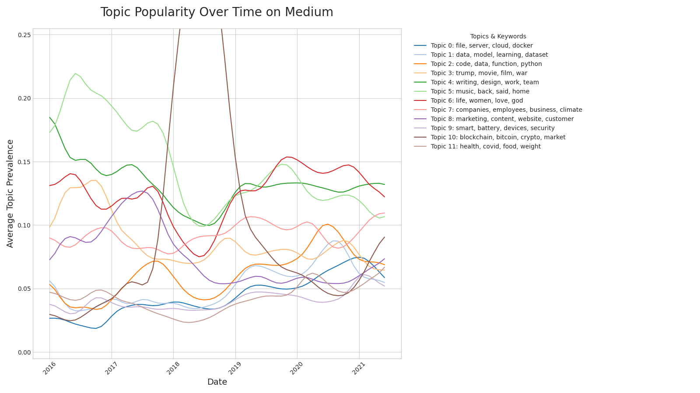
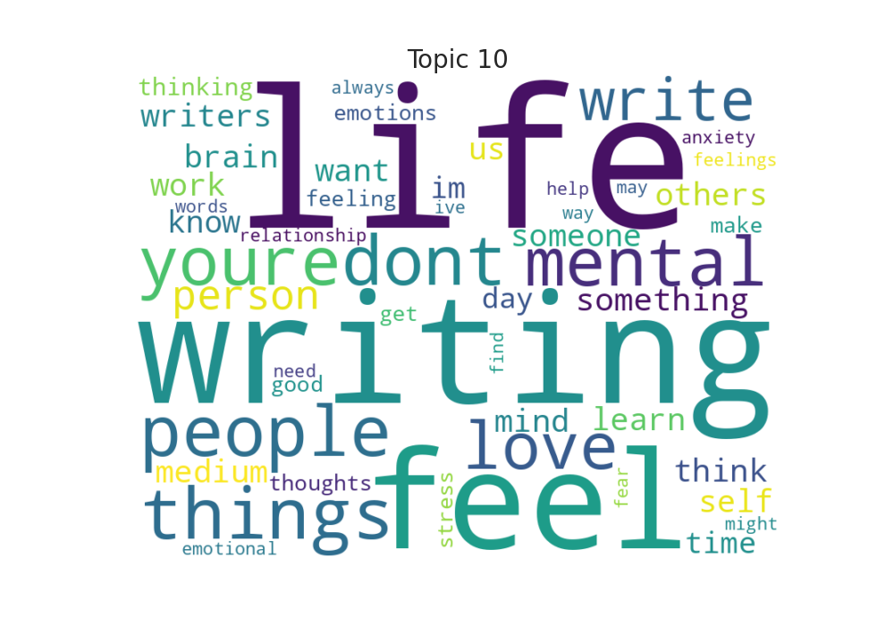

# Medium Articles: Topic Modeling and Trend Analysis over Time

The vast volume of articles on platforms like Medium presents a significant challenge: it is impossible to manually track the key topics of discussion and understand how they evolve.

This project addresses this problem by using a scalable Apache Spark pipeline to automatically discover hidden thematic trends within 191 thousand Medium articles, revealing how conversations shift over time.

## Methodology

The analysis pipeline follows these key steps:

1. Data preprocessing: The raw text from Medium articles is cleaned by converting it to lowercase and removing special characters. The text is then tokenized, and common stop words are removed to prepare it for analysis.
2. Feature engineering: The cleaned text is converted into numerical feature vectors using CountVectorizer and then IDF (Inverse Document Frequency) to weigh the importance of each word.
3. Topic modeling: A Latent Dirichlet Allocation (LDA) model is trained on the feature vectors to discover a specified number of latent topics within the articles.
4. Temporal analysis: The prevalence of each topic is calculated for each month in the dataset. This creates a time series showing how the popularity of different topics has evolved.
5. Visualization: The results are presented through two main visualizations:
    * A smoothed line graph showing the trends of all topics over time.
    * Individual word clouds for each topic, highlighting its most significant keywords.

## Project Structure

* `data/`: Stores the input and output files.
  * `input/`: Contains the input CSV file with Medium articles.
  * `output/`: Stores the generated visualizations.
* `python/`: Contains Python scripts for the analysis.
  * `main.py`: The main script to run the analysis pipeline.
  * `config.py`: Configuration class for loading parameters from `config.yml`.
  * `data_loader.py`: Functions for loading and preprocessing the dataset.
  * `topic_modeling_trends.py`: Contains functions for training the LDA model and analyzing topic trends.
  * `visualization.py`: Generates visualizations for topic trends and word clouds.
* `config.yml`: Configuration file for file paths and parameters.
* `Makefile`: Defines the build process and tasks for the project.
* `pyproject.toml`: Defines the project dependencies and configuration for Poetry.
* `README.md`: This file, providing an overview of the project.
* `requirements.txt`: Lists Python package dependencies.

## Requirements

- Java (for Apache Spark)
- Python 3.10 or 3.11
- Poetry or pip (for Python package management)

## Setup

1. Clone or copy the repo.
2. Install dependencies:
   ```bash
   pip install -r requirements.txt
   ```

3. Download and unzip the dataset of Medium articles. Place the CSV file in the `data/input/` directory. The expected file name is:

   ```
   medium_articles.csv
   ```

4. Alter the `config.yml` file to point to the correct input file path. The default is set to `data/input/medium_articles.csv`.

## Running the pipeline

To run the topic modeling pipeline, execute the following command in the terminal:

```bash
[poetry run] python main.py
```

This will start a Spark session, load the data, train the LDA model, analyze topic trends, and generate visualizations.

Sample output:
```
<timestamp> - INFO - Spark session started.
<timestamp> - INFO - Starting data preprocessing...
<timestamp> - INFO - Loaded dataset with 192368 articles and 6 columns.                                                                    
<timestamp> - INFO - Filtered dataset to 191708 articles within the date range 2016-2022.                                                  
<timestamp> - INFO - Fitting the preprocessing pipeline...
<timestamp> - INFO - Preprocessing complete.                                                                                               
<timestamp> - INFO - Training LDA model with 12 topics...
<timestamp> - INFO - LDA model training complete.                                                                                          
<timestamp> - INFO - 
--- Discovered Topics ---
<timestamp> - INFO - Topic 0:
<timestamp> - INFO -   - file (weight: 0.0058)
<timestamp> - INFO -   - server (weight: 0.0052)
<timestamp> - INFO -   - cloud (weight: 0.0049)
<timestamp> - INFO -   - docker (weight: 0.0046)
(...)
<timestamp> - INFO - Topic 11:
<timestamp> - INFO -   - health (weight: 0.0044)
<timestamp> - INFO -   - covid (weight: 0.0039)
<timestamp> - INFO -   - food (weight: 0.0036)
<timestamp> - INFO -   - weight (weight: 0.0033)
<timestamp> - INFO - -------------------------
<timestamp> - INFO - Analyzing topic trends over time...
<timestamp> - INFO - Extracted topic weights from topic distribution.
<timestamp> - INFO - Converting trend data to Pandas DataFrame.
<timestamp> - INFO - Generating and saving topic trends plot to data/output/topic_trends.png...
<timestamp> - INFO - Trends plot saved successfully.
<timestamp> - INFO - Generating and saving word clouds to data/output/wordclouds...
<timestamp> - INFO - Word clouds saved successfully.
<timestamp> - INFO - Topic trends analysis completed successfully.
<timestamp> - INFO - Stopping Spark session.
<timestamp> - INFO - Closing down clientserver connection
```

The generated visualizations will be saved in the `data/output/` directory:
* `topic_trends.png`
* `wordclouds/topic*.png`

## Findings

Running on the dataset of Medium articles, the LDA model identified several topics, each represented by a set of top words. The trends over time showed how the popularity of these topics evolved, with some topics gaining traction while others declined.

For instance, **Topic 10** (`blockchain`, `bitcoin`, `crypto`) had a prominent peak in 2018. **Topic 0** (`file`, `server`, `cloud`) showed a slow but steady increase in popularity over the years.



Word cloud for Topic 10, showing the most significant words associated with this topic:


