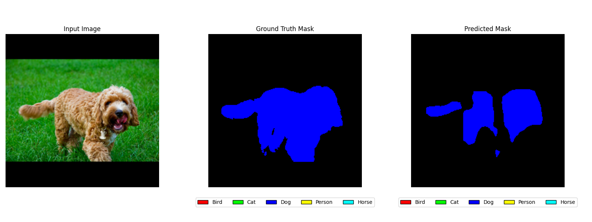

# Assignment 1: Image Segmentation

This repository contains a solution for a deep learning assignment focused on semantic image segmentation using a modified DeepLabV3 model. The project uses the Open Images dataset to perform 6-class segmentation tasks on images, combining multiple masks for each image into a single segmentation map.

---

## Model Performance

An exemplary model was trained on 6 classes from the Open Images dataset, achieving the following performance metrics on the validation set:

| Class | Accuracy | Precision | Recall | F1 Score | IoU |
|-------|----------|-----------|--------|----------|-----|
| Bird  | 0.9893   | 0.7745    | 0.6382 | 0.6998   | 0.5382 |
| Cat   | 0.9511   | 0.6453    | 0.5552 | 0.5969   | 0.4254 |
| Dog   | 0.9562   | 0.6744    | 0.3357 | 0.4483   | 0.2889 |
| Person| 0.9891   | 0.0634    | 0.0425 | 0.0509   | 0.0261 |
| Horse | 0.9799   | 0.6671    | 0.5168 | 0.5824   | 0.4108 |

Some examples of segmentation results on the validation set are shown below:




---

## Repository Structure

- **python/**  
  Contains the main Python scripts and modules for the project.

  - **dataloaders.py**  
    Implements a custom PyTorch `Dataset` class, `OpenImagesDataset`, to load images and their associated segmentation masks. It handles:
    - Reading image and mask files.
    - Combining multiple class masks into a single segmentation mask.
    - Applying optional image and mask transformations.

  - **image_util.py**  
    Contains utility functions for image and mask preprocessing:
    - **Padding and Scaling:** Functions to pad and resize images/masks to a fixed size (default: 224×224).
    - **Transforms:** Wrappers for image and mask transformations compatible with PyTorch.

  - **model.py**  
    Defines the segmentation model:
    - **DeepLabV3Model:** A modified version of the pre-trained DeepLabV3 with a custom classifier head to match the number of segmentation classes.
    - **Utilities:** Functions for setting random seeds for reproducibility and a cross-entropy loss function.

  - **task.py**  
    Contains the training and validation pipeline:
    - **Data Loading:** Reads metadata, prepares training and validation splits, and instantiates DataLoader objects.
    - **Training Loop:** Implements a training function (`train_one_epoch`) that updates model weights and logs progress.
    - **Validation Loop:** Computes validation loss and per-class metrics (accuracy, precision, recall, F1, IoU) using confusion matrix statistics.
    - **Visualization:** Provides functions to visualize input images, ground truth masks, and model predictions. Histograms of mask distributions and logits are also plotted.
    - **Checkpointing:** Saves model checkpoints based on improved validation loss.

- **notebooks/**  
Contains Jupyter notebooks for development and experimentation:

    - **download_dataset.ipynb**  
    Downloads the Open Images dataset and prepares the directory structure for training.
    - **image_segmentation.ipynb**  
    Explores the dataset, visualizes images and masks, and trains the segmentation model in a notebook environment.

---

## Requirements

- **Python Version:** 3.10 or 3.11 (other versions may work, but were not tested)
- **Third-Party Libraries:**
  - PyTorch (GPU version)
  - Torchvision
  - Pandas
  - Boto3
  - TQDM
  - Matplotlib
  - OpenCV

All dependencies are managed using [Poetry](https://python-poetry.org/).

---

## How to Run

1. **Setup Environment:**  

    1.1. **Clone the Repository:**
    ```bash
    git clone https://github.com/spacegrapefruit/msc-studies.git
    cd msc-studies/deep_learning/assignment1
    ```

    1.2. **Install Dependencies using Poetry:**
    ```bash
    poetry install -vvv
    ```

    1.3. **Activate the Virtual Environment (Optional):**
    Poetry automatically creates and manages a virtual environment for you. To activate it, run:
    ```bash
    poetry shell
    ```

2. **Prepare Data:**  
   Organize your dataset directory as mentioned above. This can be done by running the notebook `notebooks/download_dataset.ipynb`, which will download the Open Images dataset and prepare the directory structure.

3. **Training:**  
   Run the training script from the command line:
   ```bash
   python task.py
   ```
   The script will:
   - Load the dataset.
   - Train the DeepLabV3 segmentation model.
   - Evaluate and display per-class performance metrics.
   - Save model checkpoints when the validation loss improves.
   - Generate visualizations of segmentation outputs.

4. **Results:**  
   Output images and model checkpoints will be saved in the specified output directory (e.g., `../output/`).

---

## Additional Notes

- **Hyperparameters:**  
  Key hyperparameters such as learning rate, batch size, and number of epochs are defined in `task.py` and can be adjusted as needed.
- **GPU Support:**
  Ensure that your environment has access to a GPU for efficient training. The code is designed to utilize CUDA or MPS backends if available. Training takes approximately 50 minutes on GCP virtual machine with a Tesla T4 GPU.
